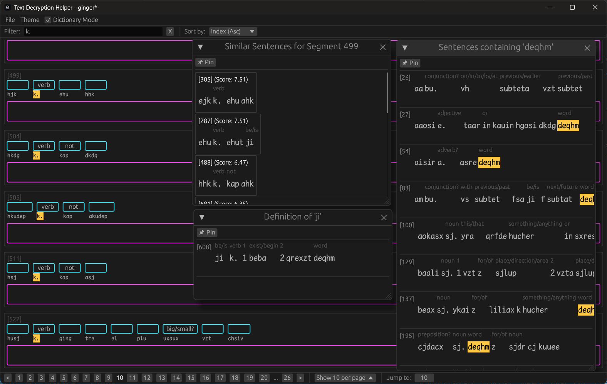

# tdecrypt_helper

> [!WARNING]
> Vibe coding project.

A GUI tool for assisted text decryption and translation.

[](https://store.steampowered.com/app/2789770/Epigraph/)

[](https://store.steampowered.com/app/3418910/Ginger/)

## Features

- **Import & Segmentation**: Import text files and segment them into tokens for analysis.
- **Glossing**: Add glosses (meanings) to individual tokens.
- **Translation**: Translate complete text segments.
- **Vocabulary Management**: Maintains a project-wide vocabulary map.
- **Typst Export**: Export projects to Typst format for professional typesetting and interlinear glossing.
- **Search**:
    - Full-text search support.
    - Similarity search using BM25 to find similar tokens or contexts.

## Usage

### Running the application

```bash
cargo run
```

### Workflow

1. **Import Text**: Load a text file to create a new project.
2. **Annotate**: Click on tokens to define them. Enter segment-level translations.
3. **Save**: Projects are saved as JSON files.
4. **Export**: Generate a Typst file to render your work as a document.
