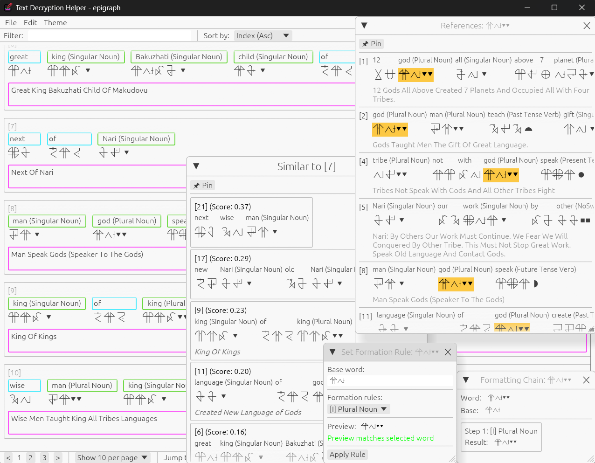
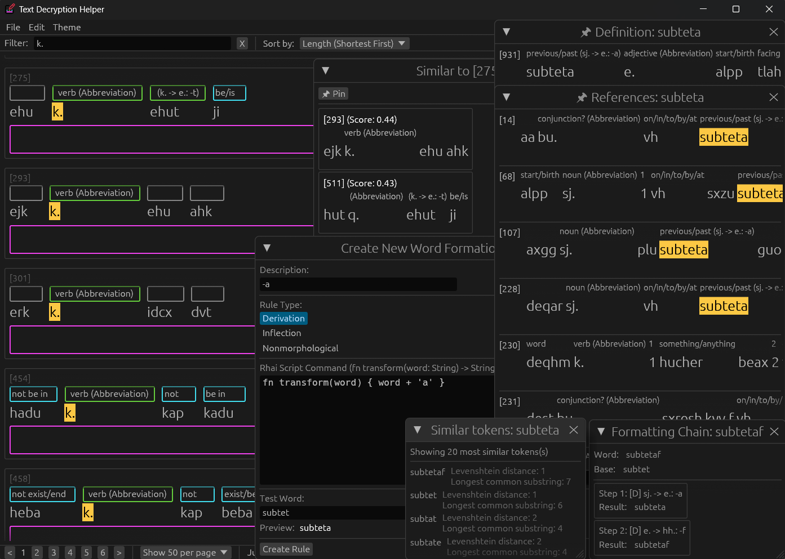

# tdector

A GUI tool for assisted text decryption and translation.

[](https://store.steampowered.com/app/2789770/Epigraph/)

> From [Epigraph](https://store.steampowered.com/app/2789770/Epigraph/)

[](https://store.steampowered.com/app/3418910/Ginger/)

> From [Ginger](https://store.steampowered.com/app/3418910/Ginger/)

## Features

### Core Functionality
- **Import & Segmentation**: Import text files and segment them into tokens (character-based or word-based) for detailed linguistic analysis.
- **Glossing & Annotation**: Add glosses (meanings/definitions) to individual tokens with persistent vocabulary tracking across the entire project.
- **Translation**: Translate complete text segments with context-aware annotations and comments.
- **Vocabulary Management**: Maintains a project-wide vocabulary map with automatic deduplication, reducing file size while preserving definitions across segments.

### Advanced Analysis
- **TF-IDF Similarity Search**: Find similar tokens and text segments using TF-IDF analysis with incremental caching for performance.
- **Full-Text Filtering**: Filter and search segments with real-time updates and multiple sort modes (by index or frequency).
- **Word Formation Rules**: Create and apply custom word formation rules (derivation, inflection, nonmorphological) using Rhai scripting:
  - Transform words based on pattern rules
  - Preview transformations before applying
  - Build vocabulary connections between related forms
- **Context Menus**: Right-click on words or segments to access quick actions:
  - Add/edit definitions and references
  - View similar segments
  - Apply word formation rules
  - Add comments and annotations

### UI Features
- **Multiple Popup Types**:
  - Dictionary popups for definitions and references
  - Similarity popups showing related segments
  - Pinned popups for persistent reference
  - Comment annotations for both words and segments
- **Custom Font Support**: Load custom fonts for special scripts and writing systems.
- **Pagination**: Navigate through large projects with customizable page size.
- **Real-Time Updates**: All changes update caches incrementally for responsive performance.

### Export & Storage
- **Typst Export**: Export annotated projects to Typst format for professional typesetting and interlinear glossing suitable for academic publications.
- **JSON Project Files**: Projects saved with space-optimized format using indexed vocabulary references.
- **Command Pattern**: Undo/redo support through command queue architecture.

## Usage

### Running the application

```bash
cargo run
```
