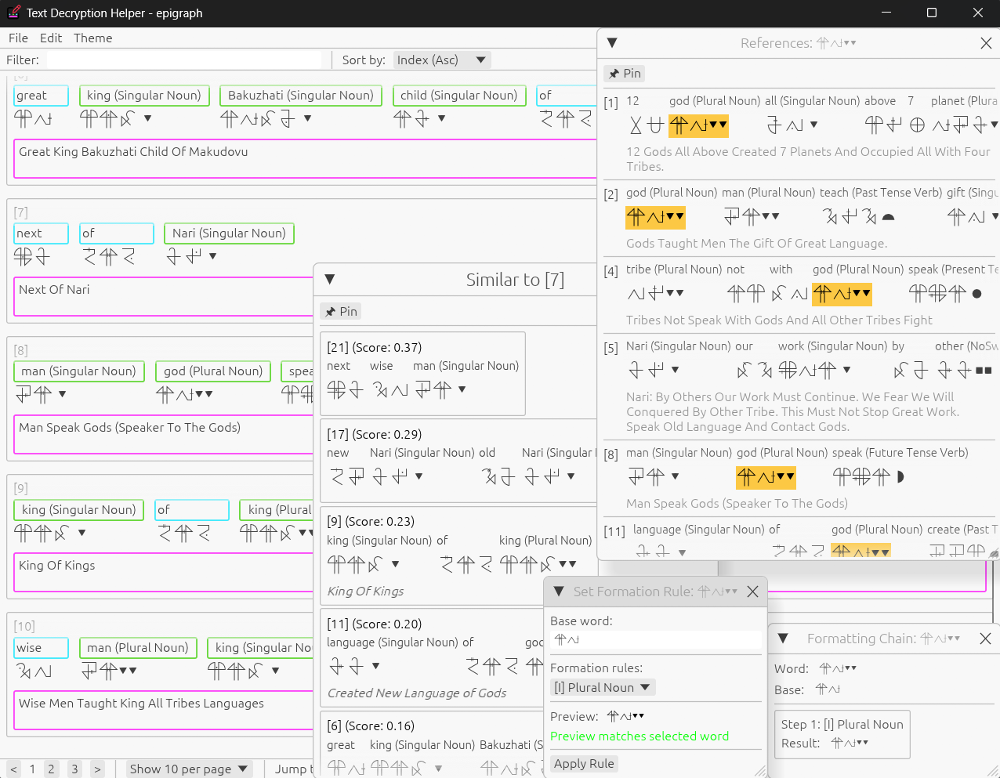
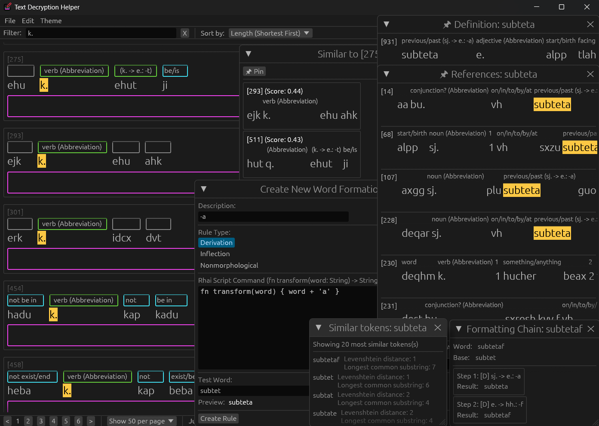

# tdector

[Try online](https://tdector.tifa-233.com/)

A tool for assisted text decryption and translation, with desktop, browser, headless command-line and MCP interfaces.

[](https://store.steampowered.com/app/2789770/Epigraph/)

> From [Epigraph](https://store.steampowered.com/app/2789770/Epigraph/)

[](https://store.steampowered.com/app/3418910/Ginger/)

> From [Ginger](https://store.steampowered.com/app/3418910/Ginger/)

## Features

### Core Functionality
- **Import & Segmentation**: Import text files and segment them into tokens (character-based or word-based) for detailed linguistic analysis.
- **Glossing & Annotation**: Add glosses (meanings/definitions) to individual tokens with persistent vocabulary tracking across the entire project.
- **Translation**: Translate complete text segments with context-aware annotations and comments.
- **Vocabulary Management**: Maintains a project-wide vocabulary map with automatic deduplication, reducing file size while preserving definitions across segments.

### Advanced Analysis
- **TF-IDF Similarity Search**: Find similar tokens and text segments using TF-IDF analysis with incremental caching for performance.
- **Full-Text Filtering**: Filter and search segments with real-time updates and multiple sort modes (by index or frequency).
- **Word Formation Rules**: Create and apply custom word formation rules (derivation, inflection, nonmorphological) using Rhai scripting:
  - Transform words based on pattern rules
  - Preview transformations before applying
  - Build vocabulary connections between related forms
- **Context Menus**: Right-click on words or segments to access quick actions:
  - Add/edit definitions and references
  - View similar segments (desktop only)
  - Apply word formation rules
  - Add comments and annotations

### UI Features
- **Multiple Popup Types**:
  - Dictionary popups for definitions and references
  - Similarity popups showing related segments
  - Pinned popups for persistent reference
  - Comment annotations for both words and segments
- **Custom Font Support**: Load custom fonts for special scripts and writing systems.
- **Pagination**: Navigate through large projects with customizable page size.
- **Real-Time Updates**: All changes update caches incrementally for responsive performance.

### Export & Storage
- **Typst Export**: Export annotated projects to Typst format for professional typesetting and interlinear glossing suitable for academic publications.
- **JSON Project Files**: Projects saved with space-optimized format using indexed vocabulary references.
- **Shared Application API**: Validated editing commands, project sessions, and queries independent of the GUI.
- **Command-Line Interface**: Query, edit, validate, batch, and export projects from scripts, with versioned JSON reports and atomic file saves.
- **MCP Server**: Connect an MCP host to one project for bounded queries, revision-checked annotation batches, previews, and explicit saves; read-only by default.

## Architecture

The GUI, CLI, and MCP server are adapters over `tdector-app`. The application crate owns project edits, validation, query caches, prepared transactions, and save revisions; it has no GUI, protocol-runtime, or native persistence dependencies. Its `api` module provides shared request/response types and rule selection. The CLI and MCP server share native file persistence through `tdector-io`.

```rust
use tdector_app::{Command, Session};
use tdector_eval::TokenizationRule;

fn main() -> Result<(), Box<dyn std::error::Error>> {
    let mut session = Session::default();
    session.import_text("cat dog", "Example", &TokenizationRule::default_whitespace())?;
    session.execute(Command::SetTranslation {
        segment: 0,
        translation: "a cat and a dog".into(),
    })?;

    let snapshot = session.save_snapshot()?;
    std::fs::write("project.json", &snapshot.bytes)?;
    session.acknowledge_saved(snapshot.token);
    Ok(())
}
```

See [the architecture guide](docs/architecture.md) for crate boundaries, editing semantics, save acknowledgments, and adapter guidance.

See [MCP setup and usage](docs/mcp.md) to connect a host, and the [MCP server design](docs/mcp-design.md) for protocol and persistence guarantees.

Run the native adapters and shared API tests without building the GUI:

```bash
cargo test --locked -p tdector-cli -p tdector-io -p tdector-mcp -p tdector-app -p tdector-core -p tdector-eval -p tdector-file -p tdector-text
```

## Usage

### Building and Using the CLI

Build only the headless `tdector` binary, or run its help directly through Cargo:

```bash
cargo build --locked --release -p tdector-cli
cargo run --locked --release -p tdector-cli -- --help
```

The executable is `target/release/tdector` (`tdector.exe` on Windows). The following examples assume it is on your `PATH`:

```bash
tdector import sample/epigraph.txt --name Example -o project.json
tdector -p project.json info --json
tdector -p project.json segment list --limit 10
tdector -p project.json segment translate 0 --text "A translated segment" --in-place
tdector -p project.json comment set --segment 0 --text "Review this passage" --dry-run --json
tdector -p project.json export typst -o project.typ
tdector -p project.json batch edits.json --in-place --json
```

For the batch example, `edits.json` contains a versioned list of commands:

```json
{
  "schema_version": 1,
  "commands": [
    { "op": "set_gloss", "word": "cat", "meaning": "animal" },
    { "op": "set_translation", "segment_index": 0, "translation": "A revised segment" }
  ]
}
```

Project queries require an explicit `--project` path. Every edit requires exactly one of `--output FILE`, `--in-place`, or `--dry-run`. Existing separate output files require `--overwrite`; editing the input file requires `--in-place`. Saves stage a complete result beside the destination before atomic replacement, and a failed batch leaves the destination unchanged. An in-place save rejects changes observed in the source since it was loaded; it assumes one writer per project.

Use `--project -` for project JSON on stdin, or `--output -` for a saved project on stdout. Only one input can consume stdin. `--json` produces a versioned report and cannot be combined with a project or export artifact on stdout. Text inputs use UTF-8 and accept one leading BOM. Segment, token, and rule indices are zero-based; the GUI displays segment numbers starting at one.

See [the CLI reference](docs/cli-design.md) for all commands, batch request schemas, script behavior, exit codes, and persistence guarantees.

### Connecting an MCP Host

Build the native stdio server and select one existing project:

```bash
cargo build --locked --release -p tdector-mcp
tdector-mcp --project /absolute/path/project.json
```

Configure your MCP host to launch `target/release/tdector-mcp` (`tdector-mcp.exe` on Windows) with those arguments. Add `--write` to enable in-memory gloss, translation, and comment batches plus explicit saves. Edits remain unsaved until `project_save`; closing the process discards them. The process owns an independent session and does not synchronize a project open in the GUI.

Read [the MCP reference](docs/mcp.md) for a host configuration example, tool semantics, revision handling, configured limits, and error recovery.

### Building the Desktop Application

```bash
cargo build --locked --release -p tdector-gui
```

The desktop executable remains `tdector-gui` (`tdector-gui.exe` on Windows). Native release artifacts include the desktop, CLI, and MCP executables.

### Building for Web

Build the WASM binary and run a development server:

```bash
trunk serve
```

This starts a local development server at `http://localhost:8080` with hot-reload support.

### Building Web Release

```bash
trunk build --release
```

The optimized WASM application will be in the `dist/` directory, ready for deployment to any static hosting service.
