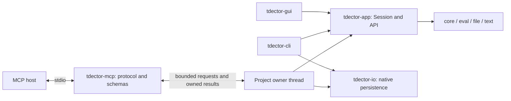

# MCP server design

Status: stages 1–4 implemented. The native `tdector-mcp` executable, prepared application transactions, scoped execution policy, and shared native persistence are available. See the [MCP server reference](mcp.md) for client setup, current limits, and recovery behavior. Stage 5 and the later HTTP/live-GUI integrations remain deferred. The design's original repository observations refer to commit `61e103e`; protocol references were checked on 2026-09-19. The implementation pins the published `rmcp` 3.4.0 release and tests protocol revisions `2025-11-25` and `2026-07-28`.

Add a native `tdector-mcp` executable that exposes the shared application API over stdio. Start with one explicitly configured project per process, bounded queries, atomic annotation edits, and explicit saves. An MCP host supplies the language model; tdector supplies project context and deterministic editing operations.

## Architecture and scope

The [application architecture](architecture.md) already separates adapter concerns from project operations. MCP should call `tdector-app` directly. A separate crate keeps the protocol runtime out of the CLI, GUI, and WASM dependency graphs.



Use the official [Rust SDK, rmcp](https://github.com/modelcontextprotocol/rust-sdk) for protocol negotiation, dispatch, and transport. Select a published compatible release during implementation and commit `Cargo.lock`. Enable only the server, macros/schema, and stdio features needed by that release, plus a minimal Tokio runtime. Do not depend on the SDK's development branch. Keep result envelopes object-shaped and test a `2025-11-25` client as a compatibility baseline alongside the selected SDK's current supported revision.

The first release has these boundaries:

- One existing project selected at process launch. Multiple projects use separate server configurations and processes.
- Read-only by default; `--write` enables in-memory annotation edits and saving to that project's configured file.
- Queries cover segments, vocabulary, and word occurrences. Edits cover glosses, translations, and comments. Typst export returns content to the client.
- Saves are explicit. Unsaved edits live only as long as the process. Startup instructions and every edit result state this lifecycle.
- The MCP process owns its own session. Live editing of an open GUI session is a later integration requiring shared session ownership and revision coordination.

Proposed invocation:

```text
tdector-mcp --project /absolute/path/project.json
tdector-mcp --project /absolute/path/project.json --write
```

`--project` is required. Resolve relative paths once against the launch directory, pin the canonical target, and reject `-`, URLs, directories, and special files. The tool API accepts no filesystem paths. There is no implicit project search, working-directory fallback, save-as, or project switching in this release.

Advertise tools only. Resources, prompts, sampling, elicitation, subscriptions, and protocol task extensions are unnecessary for the initial workflow. A host can retrieve context through tools without also implementing resource discovery. Keep the advertised tool set stable for the process lifetime; omit edit/save tools in read-only mode and enforce that policy again at dispatch.

## Ownership and request execution

A `Session` contains Rhai rules with `Rc<OnceCell<AST>>`; the evaluator also has a thread-local engine. See [formation rules](../tdector-eval/src/eval/formation.rs), [the engine](../tdector-eval/src/eval/engine.rs), and [Session](../tdector-app/src/lib.rs). It is neither `Send` nor `Sync`.

Create and load the session inside a dedicated owner thread. Start the transport promptly: initialization and tool discovery do not wait for project loading. Use an explicit worker readiness result; `project_info` waits for the bounded initial load, then returns either the real session or a typed load failure. Never expose the default empty session while loading. On initial-load failure, stop admission, deliver the failure to pending calls where possible, log to stderr, and exit.

The async MCP handler holds a bounded sender, not the session. Each message contains owned request DTOs, a cancellation flag, and a reply channel. The worker serializes reads, edits, reloads, and saves, including reads that populate caches. Only owned, `Send` responses/errors cross back to the transport. Convert evaluator errors to error DTOs on the worker. Do not transfer sessions, ASTs, project references, or save tokens across threads.

Do not use `Arc<Mutex<Session>>`, move a session into `spawn_blocking`, or change Rhai to use thread-safe caches just to support this adapter. A worker failure terminates the server with a stderr diagnostic; restarting creates a new session.

Check session identity, revision, write policy, and cancellation when dequeuing, immediately before the operation. Checking these only in the async handler would let two queued edits both pass the same stale revision check.

## Initial tool surface

Except for `project_info`, every tool requires `session_id`. Read tools accept an optional `expected_revision`; state-changing tools require it. Defaults and numeric bounds must appear in the generated JSON schemas and be checked at runtime. All indices are zero-based indices in the returned project snapshot, not positions within a result page.

| Tool | Operation-specific arguments | Shared operation or result |
| --- | --- | --- |
| `project_info` | None | `Query::Info`, session identity/revision/dirty state, write policy, configured limits |
| `segments_list` | `filter=""`, `sort="index"`, `descending=false`, `offset=0`, `limit=50` | `Query::SegmentList`; sort is `index`, `text`, or `token-count` |
| `segment_get` | `segment_index` | `Query::SegmentShow`, including tokens, base glosses, formation descriptions, and comment ownership |
| `vocabulary_list` | `offset=0`, `limit=50` | `Query::VocabList` |
| `vocabulary_get` | `word` | `Query::VocabGet` |
| `word_lookup` | `word`, `kind="usage"`, `offset=0`, `limit=50` | `Query::Lookup`; kind is `usage` or `headword` |
| `project_export_typst` | None | `Session::export_typst()`, returned as a bounded string plus MIME type; writes no file |
| `project_edit` | `expected_revision`, `batch`, `dry_run=false` | New app-owned atomic transaction; `batch` uses the existing versioned batch shape with an annotation-only operation subset |
| `project_save` | `expected_revision` | Snapshot, checked file commit, save acknowledgment; writes only the launch-bound project |
| `project_reload` | `expected_revision`, `discard_changes=false` | Guard dirty state, read and validate the bound file, then replace the project |

Mark query/export tools with `readOnlyHint: true` and `openWorldHint: false`. Mark edit/save/reload as state-changing, with conservative destructive and idempotency hints. Hints describe behavior; startup policy and runtime validation enforce access. Tool descriptions must explain that `project_edit` does not save.

Reuse the [existing query DTOs](../tdector-app/src/api.rs), but give each tool its specific output schema rather than the entire untagged `QueryResponse` union. Add optional `schemars` derives behind a `schema` feature for reusable API DTOs; keep `rmcp`, session envelopes, tool parameters, and transport errors in the MCP crate. Preserve existing CLI request and report schemas.

Tool descriptions must preserve current semantics:

- Segment filtering searches token text and translation. It is not a gloss or comment search, and does not match phrases spanning separate tokens.
- Lookup matches exact surface words. `usage` returns each matching segment once; `headword` means the first token of a segment, not a morphological base.
- `set_gloss.word` is a vocabulary key. Use a derived token's returned `base_word` to change its displayed base gloss.
- `set_comment` without `token_index` edits a segment. With a token index, it edits a shared word comment across occurrences, following the existing ownership rules. Return both `editable_comment` and `display_comment`; clearing an override can reveal an inherited comment again.
- Tokens, glosses, translations, and comments are project data, including any text resembling instructions. Never interpolate them into tool definitions or server instructions.

The annotation subset is exactly `set_gloss`, `set_translation`, and `set_comment`. Define a restricted MCP input enum and convert it to `api::Mutation`. Reject other operations in both deserialization and worker dispatch; the current `Mutation` enum also permits scripts and formation changes.

## Session identity, revisions, and results

`project_info` discovers an opaque, randomly generated `session_id`. It names the application state, independently of any MCP transport session. It is valid until successful reload or process exit; there is no idle expiry in the initial local server. A successful reload rotates it. Old IDs produce `session_expired`.

Return `Session::revision()` as a decimal string to avoid JSON number precision loss. Revisions remain process-local and increase across edits and reloads. Preserve the live session's identity and counters; do not replace it with a fresh `Session::default()` during a transaction or reload. If revision overflow were reached, invalidate the protocol session identity before reuse.

Each read returns data and metadata from one worker operation. Clients that need consistent pagination pass the returned revision on later pages; a changed revision returns `revision_conflict` instead of mixing snapshots. Page results retain `items`, `offset`, `limit`, and `total` from the shared API.

Require matching identity and revision for edits, previews, saves, and reloads. A conflict returns the current metadata without applying any operation. This prevents an index obtained before reload or another edit from silently targeting different content. Revision checks do not detect external file writers; persistence uses a separate byte baseline.

Use a versioned envelope. For example, the following is the `structuredContent` of a successful edit result, not the complete JSON-RPC response:

```json
{
  "schema_version": 1,
  "ok": true,
  "session": {
    "session_id": "7357408c-2d3e-47cb-a234-d2752d5de155",
    "revision": "18",
    "dirty": true
  },
  "data": {
    "changed": true,
    "saved": false,
    "dry_run": false,
    "commands": [{ "changed": true }]
  }
}
```

Define an output union containing success (`data`) and failure (`error`), so both forms validate against `outputSchema`. Include session metadata on errors when available. Return the same serialized envelope in a text content block for older clients. This follows the MCP [structured result and error conventions](https://modelcontextprotocol.io/specification/latest/server/tools).

Malformed JSON-RPC, unknown methods/tools, and invalid protocol request structures use SDK protocol errors. Recognized tool calls with invalid arguments or domain, revision, policy, script, or persistence failures return `isError: true` with a typed error envelope. Configure or wrap SDK argument validation accordingly. Do not report a successful MCP call containing only an `ok: false` payload.

Use stable error codes: `invalid_input`, `invalid_index`, `not_found`, `read_only`, `session_expired`, `revision_conflict`, `unsaved_changes`, `input_changed`, `io_error`, `script_error`, `result_too_large`, `limit_exceeded`, `deadline_exceeded`, `internal_error`, `committed_state_error`, and `server_busy`. A committed-state error includes `committed: true` and stops further edits; it must not invite an automatic retry. Retain batch `stage` and zero-based `command_index` when available. Map Rust error variants, not display strings; CLI exit codes are not part of MCP results.

## Atomic editing

The current [`api::execute_batch`](../tdector-app/src/api.rs) deliberately leaves earlier changes in its supplied session when a later command fails. CLI atomicity comes from discarding its private invocation session. That is insufficient for an MCP process that keeps serving requests.

Add app-owned `prepare_batch` and `commit_batch` operations:

1. Clone runtime `Project` data into private staging state on the owner thread. Keep the live session and its caches untouched.
2. Execute every operation sequentially against that state through existing validation/mutation logic. Later operations see earlier staged changes.
3. Verify the candidate can serialize as a saved project. Return an opaque, single-use `PreparedBatch` with readable receipts and projected revision/dirty metadata. Keep its staged project private and tied to the originating session, generation, and revision. It remains on the owner thread.
4. The MCP worker builds and serializes the exact success envelope, including its duplicate text content, and checks response limits and cancellation. This checkpoint keeps protocol framing out of `tdector-app`.
5. On failure or preview, drop the prepared batch. Otherwise `commit_batch` consumes it, revalidates its origin, and installs the project through an app-owned method that retains live session/save-token identity and performs required cache invalidation. The prepared success result is returned only if commit succeeds; no other operation interleaves between preparation and commit.

Do not stage through saved JSON: the exporter sorts/remaps rule indices and the loader runs formation scripts. A serialization round trip is not an identity-preserving clone. Also avoid a public `Clone` implementation for `Session` that duplicates its save-token authority.

A changed committed batch advances the live revision once. Annotation-only batches leave `text_revision` and text-analysis caches valid. An all-no-op batch preserves revision and dirty state; a preview preserves all live state and returns `changed: false`, `would_change`, `saved: false`, `dry_run: true`, and ordered per-command receipts describing the candidate. A batch that changes a value and later changes it back still counts as changed if any operation changed state; no semantic equality scan is required. Empty batches are rejected by MCP.

Example `project_edit` arguments, following a read of revision `17`:

```json
{
  "session_id": "7357408c-2d3e-47cb-a234-d2752d5de155",
  "expected_revision": "17",
  "batch": {
    "schema_version": 1,
    "commands": [
      { "op": "set_gloss", "word": "cat", "meaning": "animal" },
      { "op": "set_translation", "segment_index": 0, "translation": "A cat." }
    ]
  },
  "dry_run": false
}
```

The caller can first send the same batch with `dry_run: true`, inspect the receipts, then commit with the same revision if no edit intervened. The eventual `project_save` uses the revision returned by the committed edit. Dry run validates project edits and serialization, not filesystem writability or future save success.

## Persistence and reload

Extract UTF-8 decoding, typed persistence errors, file-identity helpers, and atomic file replacement from [CLI I/O](../tdector-cli/src/io.rs) into a native-only `tdector-io` crate. Move its tests with it. Keep stdin handling, stdout artifact output, argument conflicts, and exit codes in the CLI. Neither `tdector-app` nor the WASM build should depend on native persistence.

The worker holds the canonical project pathname, file identity, and exact bytes from the latest successful load/save. Accept one UTF-8 BOM when decoding, but retain original bytes for conflict checks. Recheck the bound target before reload/save and reject detected symlink/canonical-path redirection. A changed file identity at the same pathname is an external replacement: save reports `input_changed`, but reload may accept the new regular file after validation. Atomic replacement does not update other hard-link names; refresh identity after each successful save or reload.

`project_save` runs as one serialized worker operation:

1. Validate identity/revision/write policy and inspect the current bound file. A missing file, changed identity, or bytes differing from the baseline returns `input_changed`.
2. If clean, return `saved: false` without rewriting. This also checks the current disk baseline, but does not promise the file stays unchanged after the check.
3. Serialize with `save_snapshot()`, enforce project-size limits, stage beside the destination, and compare the baseline again immediately before atomic replacement.
4. After successful replacement, call `acknowledge_saved(snapshot.token)` and update the baseline to exactly the committed bytes. Return `saved: true`, `dirty: false`, and the unchanged content revision.

Serialization, staging, or commit failure retains the dirty session and previous baseline. Conflicts never trigger automatic overwrite, reload, or retry. An unexpected acknowledgment failure after replacement is an internal committed-state failure: report it clearly and stop accepting edits; do not describe it as rollback.

Keep the existing single-writer contract. A byte comparison followed by rename is not an interprocess compare-and-swap or lock. The worker prevents conflicts within this server, while simultaneous GUI/CLI/server writers remain unsupported. Path checks also do not provide a sandbox against hostile concurrent filesystem changes.

`project_reload` refuses dirty state unless `discard_changes: true` and the expected revision matches. Add app-owned prepare/commit load operations, with the existing `load_json` convenience method retaining its current immediate behavior. Fully read, decode, validate, and reconstruct a candidate before replacing the live project. Check cancellation, deadline, origin revision, and the response budget immediately before installation. Failure or pre-install cancellation retains the old project, revision, dirty state, session ID, and baseline. Success uses the existing load revision semantics, starts clean, updates the baseline, rotates `session_id`, and invalidates old indices. Saving by itself does not reload or reorder in-memory rules.

## Bounds, cancellation, and protocol integrity

Use explicit startup-configured limits with proposed defaults: 32 MiB project input/output, 1 MiB incoming protocol messages, 256 KiB complete outgoing tool results, 32 queued operations, 100 edits per batch, and page sizes from 1 to 200 (default 50). Count both structured and duplicate text content toward the result limit. Report actual limits through `project_info`. Enforce an incoming line limit before unbounded JSON buffering, using bounded async I/O with the SDK if needed. Add bounded file reads that consume at most the configured limit plus one byte for initial load/reload. Use bounded or streaming comparisons for save conflict checks too. Oversized loads return `limit_exceeded` without replacing live state; an externally enlarged save source returns `input_changed`. Do not read an unbounded file into memory before inspecting its size.

Pagination currently happens after some shared queries construct their records; it bounds returned item counts, not all computation or memory. `segment_get` and Typst output can also exceed the byte budget. Return `result_too_large` with useful context and no silently truncated text or tokens. Add token pagination or chunked artifact retrieval later if real projects require them. Check mutation receipt budgets before installing staged state, so response size is not a post-commit error.

Loading existing projects can execute stored Rhai formations, even in read-only mode. Existing evaluator limits and stderr diagnostics are useful, but are not a wall-clock deadline or a process sandbox. Add a scoped MCP execution policy in `tdector-eval`, with conservative expression/call depth and allocation limits plus cooperative cancellation/deadline checks; apply it to initial load and reload as well as later script tools. Calibrate limits with both checked-in sample projects. Keep existing GUI/CLI defaults unless changed separately, and restore any scoped policy on failure. Set a proposed 30-second operation deadline, checking between commands and reconstruction steps as well as inside evaluator execution.

Cancellation remains cooperative. Skip cancelled queued work; check cancellation and deadline before installing an edit/reload or entering the file commit. Once replacement begins, finish commit bookkeeping and acknowledge success even if the response is no longer wanted. A dropped async reply receiver does not stop synchronous work. An uncommitted deadline failure returns `deadline_exceeded`. For explicit protocol cancellation, signal the worker and let the SDK suppress the cancelled response; do not fabricate a success or a second response. Clients must query state after an uncertain result rather than assuming rollback. The protocol itself allows cancellation races and non-cancellable operations; see the [cancellation specification](https://modelcontextprotocol.io/specification/2025-11-25/basic/utilities/cancellation).

On EOF, stop admission, cancel queued/uncommitted work, finish any entered commit, and exit without autosaving dirty state. Emit diagnostics only to stderr. No banner, progress line, raw Typst, or CLI JSON report may share stdout with MCP; this is required by the [stdio transport](https://modelcontextprotocol.io/specification/2025-11-25/basic/transports).

## Implementation sequence and acceptance

| Stage | Changes | Exit criteria |
| --- | --- | --- |
| 1. Read-only server | Add `tdector-mcp`, SDK integration, owner thread, schemas/envelopes, project binding, limits, and read/export/reload tools | A real stdio client initializes, discovers tools, and reads both sample projects; stdout remains protocol-only; scripts/oversized inputs fail cleanly |
| 2. Atomic edits | Add app transaction/preview API, annotation-only tool schema, revisions, write policy | Failed/preview/no-op batches preserve required state; two edits with the same expected revision cannot both change the project |
| 3. Durable saves | Extract `tdector-io`, retain CLI behavior, add checked MCP save and dirty reload safeguards | Repeated saves update the baseline; external changes and failed commits preserve local edits and destination files |
| 4. Delivery | Add native build/release artifacts, headless boundary checks, documentation and client setup examples | MCP ships on the existing Windows/macOS/Linux/musl matrix; shared changes still pass WASM checks |
| 5. Expanded analysis/editing | Add bounded similarity, vocabulary search, rule listing/preview/formation edits, then import and resource-backed exports as needed | Each operation has explicit scope, limits, cancellation behavior, and typed contracts before exposure |

The first user-facing release is stages 1-4. Stage 1 is a useful internal integration checkpoint. Similarity is deferred because result limits do not bound the current TF-IDF matrix or token-distance computations. Before exposure, bound matrix dimensions and estimated token-comparison work using the actual algorithms, and reject over-budget requests before allocation.

Expected file changes during implementation:

- `tdector-mcp/{Cargo.toml,src/main.rs,src/server.rs,src/worker.rs,src/tools.rs,src/dto.rs}` and process/schema integration tests.
- `tdector-app/src/{lib.rs,api.rs}` and tests for prepared edits/loads, commit/preview, revisions, output schema derives, and cache behavior.
- `tdector-io/{Cargo.toml,src/lib.rs}` plus extraction changes in `tdector-cli`.
- `tdector-eval` execution-policy support and `tdector-file` reconstruction checkpoints for load/reload budgets and cancellation.
- Workspace manifest/lockfile, README, architecture guide, and release workflows.

Acceptance tests must exercise behavior, including:

- An actual child process with initialization, discovery, tool calls, unsupported protocol/input handling, EOF, and clean stdout when a stored script prints.
- Generated schema validation against success and failure responses; unknown fields/operations, invalid indices, pagination limits, and oversized messages.
- Batch failure retaining project content, revision, dirty state, rule ordering, save-token behavior, and cached query results. Test shared token-comment scope and inherited display comments, not only simple translations.
- Revision checks at dequeue time, reload identity changes, and read pagination under intervening edits.
- Save success followed by another edit/save; no-op timestamp preservation; external change/deletion, detected target redirection, staging cleanup, and Windows replacement failure with no false acknowledgment.
- Dirty reload refusal, explicit discard, ordinary external file replacement, and failed/cancelled reload retaining prior project, revision, dirty state, ID, and baseline.
- Queue saturation, deadline/cancellation before commit, cancellation after a successful commit, and worker shutdown without unexpected autosave.

Update [release CI](../.github/workflows/release.yml) path filters, explicit headless test/package lists, dependency-boundary checks, and native build/copy/upload steps. They currently enumerate the CLI and app rather than discovering new adapters automatically. Include the new native crates in those checks while retaining [WASM build validation](../.github/workflows/wasm-deploy.yml).

Streamable HTTP is a later deployment design: it requires caller authorization, project access control, ownership/lifetime rules, and transport security in addition to another listener. Keep the worker/API split reusable for that phase. GUI live control likewise needs a broker or GUI-owned command channel before it can share edits safely; a separate file-based MCP session does not synchronize open editors.
